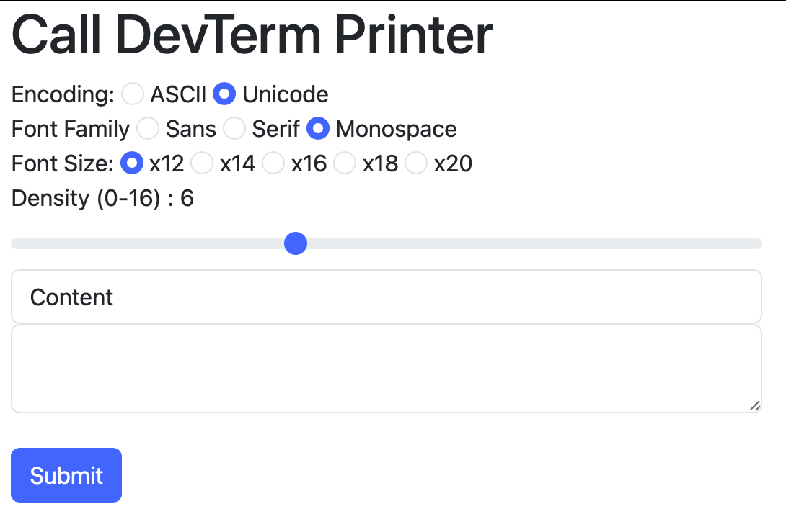

# DevTerm Print Server

A web printing server using the device-based printing API

## Installation

This project depends on SBCL and Quicklisp package manager. Please install above, place the directory to `~/common-lisp/devterm-print-server/`, try `./start.sh` to start the server. Visit `127.0.0.1:4242` for web dashboard.

There's `devterm-print-server.service` systemd service file. Place it into `/etc/systemd/system/` to manage the service using systemd.

It's recommend to install `fonts-noto-cjk fonts-noto-mono` for supporting Unicode font switching function.
